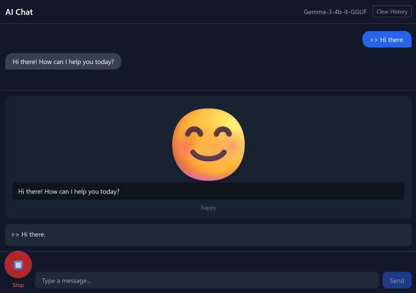

# Emo: Emotional Emoji AI Buddy :smile:

## Overview



Emo is an expressive AI chatbot built with Nuxt on the frontend and [Lemonade Server](https://lemonade-server.ai/) on the backend. It transcribes your speech in real time and dynamically changes its facial expression based on the AI's response.

**Features:**

- Runs entirely on your local machine via Lemonade Server — no data sent to the cloud
- Real-time speech recognition and transcription
- Dynamic emotion display driven by AI responses
- Thanks to Lemonade Server, you can use a GPU (NVIDIA/AMD) or a Ryzen AI NPU (AI 300 series and later) for better performance

**Limitations:**

Due to the models currently supported by Lemonade Server, the following constraints apply:

- **English only** — The TTS model (`kokoro-v1`) is trained on English.
- **Speech recognition latency** — Whisper currently runs on CPU only, so it can be hard to achieve both low latency and high accuracy at the same time

## Getting Started

### Setup

```sh
npm install
cp .env.example .env
```

### Start Lemonade Server

Launch Lemonade Server and load the following models:

| Role               | Model                          |
|--------------------|--------------------------------|
| LLM                | `Gemma-3-4b-it-GGUF` (or any model suited to your environment) |
| Speech Recognition | `Whisper-Base`                 |
| TTS                | `kokoro-v1`                    |

If you use different models, update the values in `.env` accordingly.

### Run the App

```sh
npm run dev
```

Open <http://localhost:3000/> in your browser.

## Troubleshooting

**WSL networking issue:** If you run Lemonade Server on Windows and Emo inside WSL, Emo may not be able to reach the server. To fix this, open **WSL Settings** and set **Networking Mode** to `Mirrored`.

## What's Next?

- Make Emo recognize its own name and the pronunciation.
