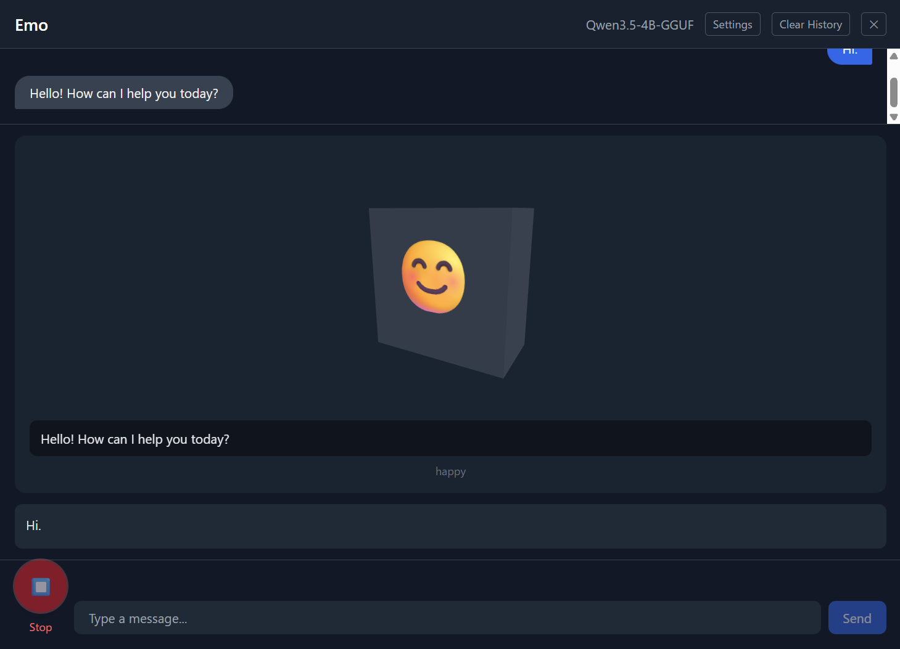

# Emo: Emotional Emoji AI Buddy :smile:

## Overview



Emo is an expressive AI chatbot built with Nuxt on the frontend and [Lemonade Server](https://lemonade-server.ai/) on the backend. It transcribes your speech in real time and dynamically changes its facial expression based on the AI's response.

**Features:**

- Runs entirely on your local machine via Lemonade Server — no data sent to the cloud
- Real-time speech recognition and transcription
- Dynamic emotion display driven by AI responses
- Thanks to Lemonade Server, you can use a GPU (NVIDIA/AMD) or a Ryzen AI NPU (AI 300 series and later) for better performance

**Limitations:**

Due to the models currently supported by Lemonade Server, the following constraints apply:

- **English only** — The TTS model (`kokoro-v1`) is trained on English.
- **Speech recognition latency** — Whisper currently runs on CPU only, so it can be hard to achieve both low latency and high accuracy at the same time

<br>

## Quick Start

### Install Emo

Install Emo by downloading the latest release from the [Releases](https://github.com/ryomo/emo/releases) page.

<details>
  <summary>Windows users:</summary>

  ---

  SmartScreen on Windows may block the app since it's not signed. If that happens, click "More info" and then "Run anyway". Or it may be better to build the executable yourself by following the instructions in the [Development](#development) section below :smirk:

  - `emo_***_portable.exe` is the portable version that doesn't require installation. You can run it directly. But you may need to install the required Visual C++ Redistributable if you don't have it already.
  - `emo_***_setup.exe` is the installer version.

  ---
</details>

<details>
  <summary>Linux users:</summary>

  ---

  - `emo_***_amd64.AppImage` is the x64 portable version that doesn't require installation.
  - `emo_***_aarch64.AppImage` is the arm64 portable version that doesn't require installation.

  ---
</details>

<details>
  <summary>macOS users:</summary>

  ---

  NOTE: Mac version has not been tested yet. If you have tried it and it works, please let me know :smile:

  Only Arm (Apple Silicon) Macs are supported.

  Like Windows, macOS may block the app since it's not signed. You can bypass this by right-clicking the app, selecting "Open", and then confirming to open it.

  ---
</details>

### Start Lemonade Server

Launch Lemonade Server and load the following models:

| Role                  | Model                                                       |
|-----------------------|-------------------------------------------------------------|
| LLM with tool-calling | `Qwen3.5-9B-GGUF` (or any model suited to your environment) |
| Speech Recognition    | `Whisper-Base`                                              |
| TTS                   | `kokoro-v1`                                                 |

NOTE: If you change the model names, make sure to update "Settings" in Emo accordingly.

<br>

## Uninstall

You can uninstall Emo according to the standard procedure for your OS.

However, Emo's configuration file is stored separately and won't be removed automatically. You can delete it manually if you want to remove all settings:

- Windows: `C:\Users\<User>\AppData\Roaming\com.github.ryomo.emo`
- Linux: `/home/<user>/.config/com.github.ryomo.emo`
- macOS: `/Users/<user>/Library/Application Support/com.github.ryomo.emo`

<br>

## Troubleshooting

### WSL networking issue

If you run Lemonade Server on Windows and Emo inside WSL, Emo may not be able to reach the server. To fix this, open **WSL Settings** and set **Networking Mode** to `Mirrored`.

### "Enable Thinking" option doesn't work

If you disable "Enable Thinking" in settings, but the model still seems to be "thinking" and takes a long time to respond, set `--chat-template-kwargs '{"enable_thinking": false}'` to "LLAMACPP ARGUMENTS" in Lemonade Server's model configuration.

<br>

## Development

### Setup

```sh
npm install

# pnpm
pnpm install
```

### Run the App in your Browser

```sh
npm run dev

# pnpm
pnpm dev
```

Open <http://localhost:3000/> in your browser.

NOTE: In this mode, app settings do not persist. Settings changes won't be saved to disk.

### Build Executable with Tauri

First, make sure you have the [Tauri prerequisites](https://tauri.app/start/prerequisites/) installed, then run:

```sh
npm run tauri dev

# pnpm
pnpm tauri dev
```

This will launch the app in development mode with Tauri.

If everything works fine, you can proceed to build the production executable:

```sh
npm run tauri build

# pnpm
pnpm tauri build
```

The built executable will be located in `src-tauri/target/release/`.

<br>

## Release Process

Below is the process for releasing a new version of Emo on GitHub.\
Just a reminder for myself :smile:

1. Go to **Actions** → **release** → **Run workflow**, enter the version number (e.g. `1.2.3`), and run it.
   - This automatically updates `src-tauri/tauri.conf.json` and `src-tauri/Cargo.toml`, commits the changes, and creates + pushes the `v*.*.*` tag.
   - Then, the app is built and a draft release is created for each platform.
2. Once the workflow completes, go to the GitHub releases page, find the draft release, review the content, and publish it.
3. Don't forget `git pull` to update your local repository with the new tag.
